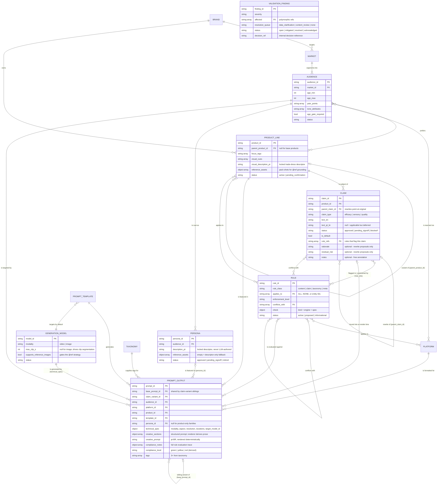
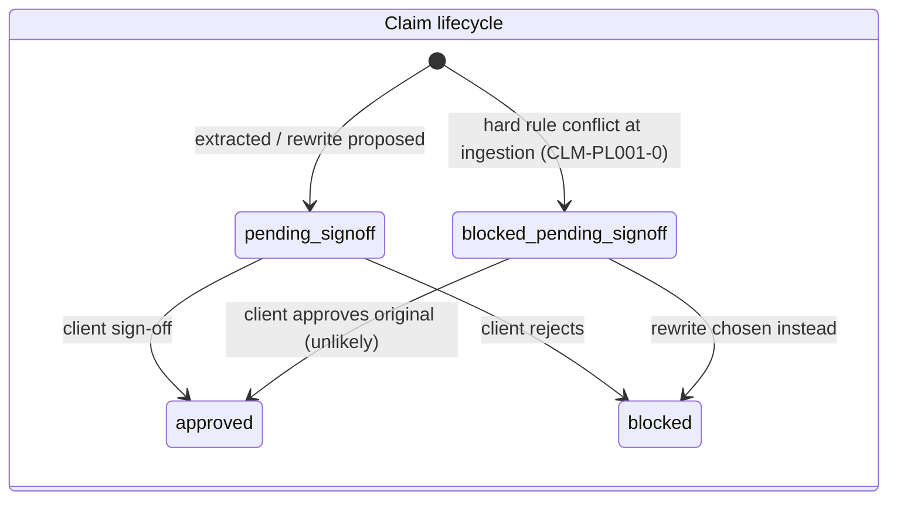
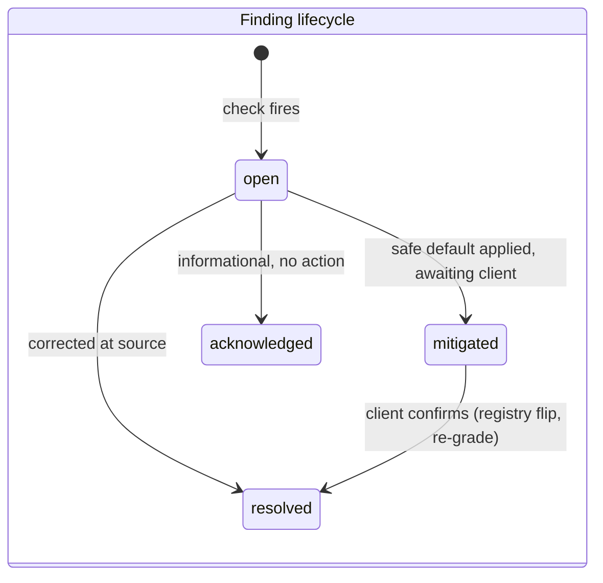

# Data Model — Normalized Campaign Dataset

**Subtask A deliverable** · machine-readable twin: [`dataset.json`](dataset.json) · validation contract: [`schema.json`](schema.json)

The dataset is a small relational database serialized as JSON: each entity type is a table, each record a row with a primary key, and all connections are foreign-key references. Rules bind to entities by ID; if those bindings are ambiguous or dangling, the rule engine misfires silently — which is why referential discipline, not prompt quality, is the foundation of the whole system.

---

## 1. Entity-relationship diagram

Two reference types are deliberately **polymorphic** (typed by ID prefix rather than a fixed target table): `rule.applies_to` / `rule.conflicts_with` (may point at products, platforms, rules, or claims) and `validation_finding.affected` (may point at anything, including raw source fields). The validator resolves prefixes (`PL-`, `PLAT-`, `RULE-`, `CLM-`, `AUD-`); an unresolvable reference becomes a finding, never a crash — that is the RULE-404 lesson as engine behavior.

**Diagram scope:** attribute blocks show structural fields — keys, discriminators, lifecycle status — plus, for CLAIM (the worked example), the optional fields. The diagram is a map, not the contract: the **complete, authoritative field definition for every entity is [`schema.json`](schema.json)**, which is also what the validator enforces.

### Field discipline: absent vs. null vs. value

Rows of the same entity may legitimately carry different fields. The dataset distinguishes three states, and the distinction is load-bearing:

| State | Meaning | Example |
|---|---|---|
| **absent** | Field is *not applicable* to this row's kind | `rationale` on CLM-PL001-0 — originals aren't proposals, there is no rationale to record |
| **null** | Field is *applicable but deliberately unknown or deferred* | `text_pt_br: null` on CLM-PL003PRO-0 — rendering deferred until product confirmation; `platform_min_age: null` on PLAT-RET — unknown, needs clarification |
| **value** | Known | everything else |

Optional fields are therefore **omitted, never null-padded**: padding CLM-PL001-0 with `"rationale": null` would assert "a rationale exists but is unknown," which is false. This is the same not-applicable/unknown distinction the null policy in FND-006 depends on (OOH vs. Retail Media min-age) — uniform null-padding would erase it. `schema.json` encodes which state each field may take: required fields must be present (and are nullable only where explicitly typed so); optional fields may be absent.

---

## 2. Entity reference

| Entity | PK | What it is | Lifecycle / notes |
|---|---|---|---|
| `brand` | `BRD-HS-BR` | Brand context, voice attributes | ID normalized from `BRD-H&S-BR` (FND-011) |
| `market` | `MKT-*` | Regional market with socioeconomic classes | Bidirectional consistency with audiences validated |
| `audience` | `AUD-A…F` | Target segment: ages, pain points, tone, preferred products, platforms | `age_min ≥ 18` enforced at schema level (RULE-EXCL-012); tones/personas split into arrays |
| `persona` | `PERS-*` | **Named cast member with a locked visual descriptor** | Source `persona_names` promoted to first-class entities; same sign-off lifecycle as claims — client approves once, every referencing output inherits it. `reference_assets` empty = descriptor-only fallback |
| `product_line` | `PL-*` | Product or product variant | `parent_product_id` makes variants children; status: `active` / `pending_confirmation`. Parent-bound rules cascade to variants. `visual_description_pt/_en` + pack-shot `reference_assets` ground the entity in prompts |
| `platform` | `PLAT-*` | Channel with format, duration, min-age, hook/CTA specs | `cta_category` added (normalized from RULE-INCL-005's prose); nulls covered by null policy (FND-006); `aspect_ratio`/`resolution` split out of the prose `format` — canonical picks documented in platform notes |
| `generation_model` | `MODEL-*` | **Target endpoint registry** — placeholder SOTA enum | Capability fields (`max_clip_s`, `supports_reference_images`) make clip segmentation and reference strategy deterministic lookups; swapping endpoints is a data change |
| `claim` | `CLM-*` | **First-class claim registry** — the load-bearing addition | Status lifecycle below; rewrites are children via `parent_claim_id`; exactly one default per family |
| `rule` (content/claim/taxonomy/meta) | `RULE-*` | Normalized rules matrix with machine-evaluable `check` spec | `rule_class` implements the briefing's content_rule/claim_rule split; `status: proposed` for RULE-COMP-004 |
| `taxonomy` | `TAX-*` | Controlled tag vocabulary + traffic-light definitions | Makes tag validation an enum check |
| `prompt_template` | `TPL-*` | Slot-based generation template | Slots declare their source: `generated_llm` vs. `render_time_binding` (claim slot) vs. `static`. Also adds `modality`, `default_model_id`, `target_duration_s`, and `sections` — the canonical prompt layout, entities first |
| `content_banks` | — | **Provenance-tagged pt-BR content for the deterministic stub** | Authored/localized/derived strings relocated out of `pipeline/content.py` so no consumer-relevant data lives in code; each bank carries `provenance` (client_provided / localization / authored_pending_signoff / derived). The live LLM path reads none of these — it renders from canonical entity data |
| `prompt_output` | `{SP}-{A}-{IGR}-{001}[-c1]` | One generated prompt as a full dataset row | `base_prompt_id` groups claim-variant siblings; `compliance_level` is derived, never authored; `technical_spec` carries the machine-readable generation parameters, `creative_sections` the structured prompt |
| `validation_finding` | `FND-*` | One detected data problem with resolution routing | The §5 audit issues, machine-readable; each routes to one of the two human queues |
| `codes` | — | Short-code map for prompt ID derivation | `MKT-SP → SP` etc. |

### Source → normalized transforms (the audit trail)

- Comma-joined strings → arrays (`tone`, `socioeconomic_class`, `persona_name`)
- `key_claim` strings on products → **extracted into the claim registry** with status lifecycle
- Duplicate `PL-003` → base + variant child `PL-003-PRO`, `pending_confirmation` (FND-001)
- `_`-prefixed internal fields and TODOs → stripped at ingestion, logged (FND-007)
- `BRD-H&S-BR` → `BRD-HS-BR` (FND-011)
- RULE-INCL-005's prose CTA mapping → `platform.cta_category` enum
- Rules matrix `conflict_with: "PL-001 key_claim"` → resolved claim reference `CLM-PL001-0`
- New: `RULE-COMP-004` proposed — the matrix asked "Complete? Not sure." This is the demonstrated answer.
- v1.1.0: `persona_names` arrays → `personas` registry with locked descriptors; `platform.format` prose → `aspect_ratio`/`resolution` machine fields (canonical picks documented per platform); `generation_models` registry added; `RULE-TECH-001/002/003` proposed (prompt-output feedback round).

### Entity grounding — the hybrid reference strategy

A generation model knows nothing about "Lucas" or what an H&S bottle looks like; identity must be data, not generation luck. Personas and products therefore carry **locked visual descriptors** (pt-BR + EN) and optional **reference assets**. The assembler resolves the strategy per output, deterministically: if the target model `supports_reference_images` *and* the entity has assets, it emits an `@ref` handle **plus** the descriptor (the ref pins identity, the text disambiguates wardrobe and styling); otherwise it falls back to descriptor-only. Descriptors are never LLM-authored — the same principle as render-time claim binding. Products ship with placeholder pack-shot assets (every CPG client has these in a DAM); personas ship descriptor-only until approved talent or persona sheets exist, which demonstrates both paths in the same batch.

---

## 3. Status lifecycles

Products share the same pattern (`active` / `pending_confirmation` → `active` or `retired`). The key property everywhere: **a status flip re-grades affected outputs mechanically — no regeneration, no new creative review cycle.**

---

## 4. The `check` spec — rule evaluability taxonomy

Every rule carries a machine-readable classification of *how* it can be evaluated. This is where the deterministic/agentic architecture split lives as data, not prose:

| `check.kind` | Engine | Examples | Cost profile |
|---|---|---|---|
| `deterministic_pattern` | Code (lexicon/regex) | EXCL-001 medical terms, EXCL-009 guarantees, COMP-001 superlatives, INCL-003 language detection | Free, reproducible, auditable |
| `deterministic_structural` | Code (field logic) | EXCL-012 age check, INCL-008 pain-point membership, TAG-001 tag count, COMP-004 age-consistency | Free, reproducible, auditable |
| `llm_judgment` | LLM subagent | EXCL-005 "shame as *primary* mechanism", INCL-006 "feels true to lifestyle", EXCL-003 implied discrimination | Paid, batched, second net only |
| `process_gate` | Workflow state | EXCL-008 price claims need an approved + dated source artifact | Not evaluable from content at all |
| `none` | — | RULE-404 (informational) | — |

Rules may declare a `secondary` check — the standard pattern is *deterministic trigger → LLM disambiguation* (e.g., EXCL-006 fires on "antes e depois", then an LLM judges whether the comparison is unrealistic; EXCL-011 fires on "dermatologically", then distinguishes testing claims from advice-replacement claims).

---

## 5. Enforcement → traffic light (derivation, not judgment)

| `enforcement_level` | On hit / unmet | `compliance_level` effect |
|---|---|---|
| `hard_block` | hit | **red** — blocked from export |
| `required` (include) | unmet | **red** — output invalid |
| `soft_flag` | hit | **yellow** — human review before release |
| `recommended` (include) | unmet | note only — no level change |
| `informational` | — | surfaced, no effect |

`compliance_level` is **derived** from the evaluation trace (`compliance_notes`), never authored — RULE-TAG-002's green/yellow/red is the output of this table, applied mechanically.

---

## 6. ID conventions

| Prefix | Entity | Example |
|---|---|---|
| `BRD-` | brand | `BRD-HS-BR` |
| `MKT-` | market | `MKT-REC` |
| `AUD-` | audience | `AUD-F` |
| `PERS-` | persona | `PERS-F-01` |
| `PL-` | product line (`-SUFFIX` = variant) | `PL-003-PRO` |
| `PLAT-` | platform | `PLAT-IGR` |
| `MODEL-` | generation model (`VID`/`IMG` = modality) | `MODEL-VID-SEEDANCE-2` |
| `AST-` | reference asset (pack shot, persona sheet) | `AST-PL001-PACK-01` |
| `CLM-` | claim (`-0` original, `-R*` rewrites) | `CLM-PL001-R1` |
| `RULE-` | rule | `RULE-COMP-004` |
| `TPL-` | prompt template | `TPL-VID-VERT-01` |
| `FND-` | validation finding | `FND-003` |
| prompt | `{market}-{audience}-{platform}-{seq}[-c{n}]` | `SP-A-IGR-001-c1` |

The prompt ID is **fully derivable from its foreign keys** — given any prompt ID, you can reconstruct exactly which market, audience, platform, and claim variant produced it. That property is what makes batch auditing and filtering possible downstream.

---

## 7. The two human queues (routing, not afterthought)

Every finding routes to exactly one resolution queue, encoded in the data:

- **`content_review`** — a reviewer judges a *generated output* (tone, claims-in-context, sensitive themes). Resolves yellow flags.
- **`data_clarification`** — the client/data owner answers a *data question*; the correction lands in the input data and re-runs ingestion. Resolves entity-integrity, delivery-config, content-provenance, craft, and authored-rule issues (FND-001, -002, -003, -004, -006, -010, -013, **-016, -017**, and the craft cues -014/-015). A content reviewer can never resolve these — nothing in the output text contains the answer.

Current findings: **17** (2 blockers — both mitigated, 2 high, 6 medium, 4 low, 3 info); 11 route to `data_clarification`, 2 to `content_review`, 4 are informational/mechanical (`none`). The provenance set surfaces everything the pipeline *authored* rather than received from the client — content (**FND-013**), visual-cue craft contradictions (**FND-014/-015**), persona and product identity (**FND-016**), and the proposed rule extensions (**FND-017**) — so nothing invented is ever treated as canonical silently. Full list with resolution paths in [`dataset.json`](dataset.json) → `validation_findings`.
